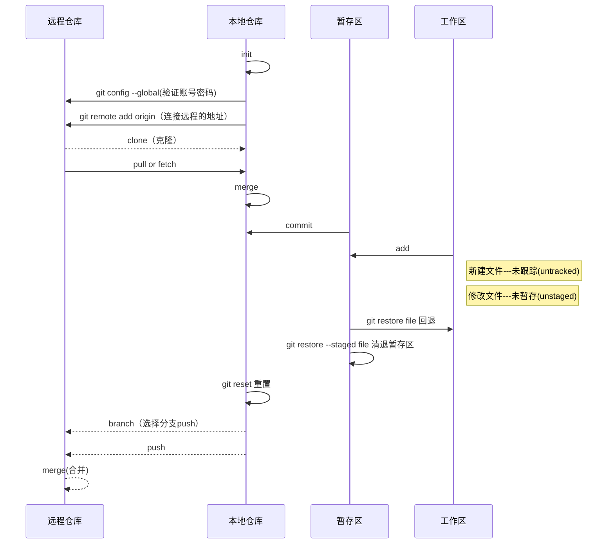

版本控制工具

>Git  是什么?
>
>Git 是一个分布式版本控制系统
>
>Git 是一个对项目文件管理的工具，有着版本控制等功能

```mermaid
sequenceDiagram
	participant 远程仓库
 	本地仓库->>本地仓库:  init
	本地仓库->>远程仓库: git config --global(验证账号密码)
	本地仓库->>远程仓库: git remote add origin（连接远程的地址）
	远程仓库-->>本地仓库:  clone（克隆）
	远程仓库->>本地仓库: pull or fetch
	本地仓库->>本地仓库: merge
	暂存区->>本地仓库:  commit
    工作区->>暂存区: add
	Note right of 工作区 : 新建文件---未跟踪(untracked)
	Note right of 工作区 : 修改文件---未暂存(unstaged)
	暂存区->>工作区: git restore  file 回退
	暂存区->>暂存区: git restore --staged file 清退暂存区
	本地仓库->>本地仓库: git reset 重置
	本地仓库-->>远程仓库: branch（选择分支push）
	本地仓库-->>远程仓库: push
	远程仓库-->>远程仓库: merge(合并)
```

> git 文件管理 会 忽略 .gitignore 文件中的文件路径