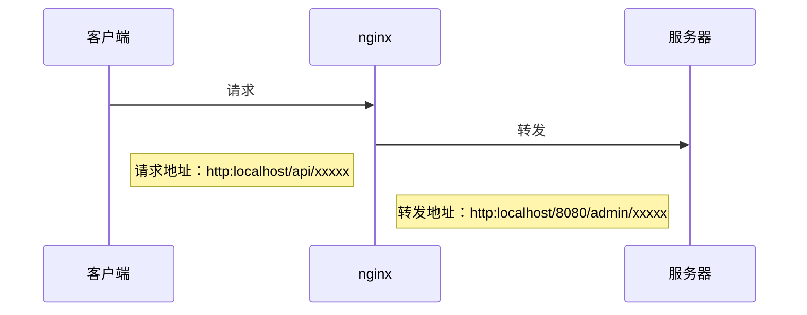

## 代理、正向代理以及反向代理

代理：通过第三方（第一第二方为服务器端和客户端）服务器来进行代理，让服务器端和客户端不直接碰面，从而成功请求响应数据。

### 正向代理：

forward proxy

代理的是客户端，去和服务器端交互

客户端给代理服务器发送请求，由代理服务器转发给服务器端，并把响应的内容转发回客户端

用处：

- **突破访问限制** 

  类似vpn，使用不属于本地网络来访问不能访问的地方

- **提高访问速度**

  通常代理服务器都设置一个较大的硬盘缓冲区，会将部分请求的响应保存到缓冲区中，当其他用户再访问相同的信息时， 则直接由缓冲区中取出信息，传给用户，以提高访问速度。

- **隐藏客户端真实IP**

  服务器端交互 的是代理服务器而不是客户端，起到了隐藏的作用

### 反向代理：

**reverse proxy**

代理的是服务器端，去和客户端交互

作为伪装的服务器端接受请求把请求转发给服务器端，并假装服务器端把真正的服务器响应的数据给客户端

用处：

- **隐藏服务器真实IP**
使用反向代理，可以对客户端隐藏服务器的IP地址。


- **负载均衡**
反向代理服务器可以做负载均衡，根据所有真实服务器的负载情况，将客户端请求分发到不同的真实服务器上。


- **提高访问速度**
反向代理服务器可以对于静态内容及短时间内有大量访问请求的动态内容提供缓存服务，提高访问速度。


- **提供安全保障**
反向代理服务器可以作为应用层防火墙，为网站提供对基于Web的攻击行为（例如DoS/DDoS）的防护，更容易排查恶意软件等。还可以为后端服务器统一提供加密和SSL加速（如SSL终端代理），提供HTTP访问认证等。

### Nginx设置代理

#### 设置 404 页面导向地址

```nginx
error_page 404 https://www.error.com; #错误页
proxy_intercept_errors on;    #如果被代理服务器返回的状态码为400或者大于400，设置的error_page配置起作用。默认为off。
```


#### 如果我们的代理只允许接受get，post请求方法的一种

```nginx
proxy_method get;    #支持客户端的请求方法。post/get；
```


#### 设置支持的http协议版本

```nginx
proxy_http_version 1.0 ; #Nginx服务器提供代理服务的http协议版本1.0，1.1,默认设置为1.0版本
```

设置HTTP2

```nginx
server {
    listen 443 ssl http2; #设置前端2.0 443接口支持 http2以及SSL
    server_name example.com;

    ssl_certificate /path/to/your/certificate.crt;
    ssl_certificate_key /path/to/your/private.key;

    location / {
        proxy_pass http://backend;
        proxy_http_version 1.1; #后端还是1.1 
        proxy_set_header Connection "";
        proxy_set_header Host $host;
        proxy_set_header X-Real-IP $remote_addr;
        proxy_set_header X-Forwarded-For $proxy_add_x_forwarded_for;
        proxy_set_header X-Forwarded-Proto $scheme;
    }
}

upstream backend {
    server backend1.example.com;
    server backend2.example.com;
}

```

在 Nginx 配置中，即使前端使用的是 HTTP/2，与后端服务器的通信通常仍然使用 HTTP/1.1。原因在于，HTTP/2 的主要优点（如多路复用、头部压缩和服务器推送）主要体现在客户端和 Nginx 之间的通信中。Nginx 作为反向代理服务器，可以将前端的 HTTP/2 请求转换为后端的 HTTP/1.1 请求，这样可以确保与后端服务器的兼容性和稳定性。


#### 负载均衡时，某服务器超时/连接失败 时不再请求

例如有俩个服务器A，B，B连接不上了，这个时候再发送给B请求就会超时，等待响应时间长，才把重新请求发给A，可以断开链接

```nginx
proxy_connect_timeout 1;   #nginx服务器与被代理的服务器建立连接的超时时间，默认60秒
proxy_read_timeout 1; #nginx服务器想被代理服务器组发出read请求后，等待响应的超时间，默认为60秒。
proxy_send_timeout 1; #nginx服务器想被代理服务器组发出write请求后，等待响应的超时间，默认为60秒。
proxy_ignore_client_abort on;  #客户端断网时，nginx服务器是否终端对被代理服务器的请求。默认为off。
```


#### 负载均衡时设置异常情况切换下一个服务器

如果使用upstream指令配置一组服务器作为被代理服务器，服务器中的访问算法遵循配置的负载均衡规则，同时可以使用该指令配置在发生哪些异常情况时，将请求顺次交由下一组服务器处理。

```
proxy_next_upstream timeout;  #反向代理upstream中设置的服务器组，出现故障时，被代理服务器返回的状态值。
```

状态值可以是：

- error：建立连接或向被代理的服务器发送请求或读取响应信息时服务器发生错误。
- timeout：建立连接，想被代理服务器发送请求或读取响应信息时服务器发生超时。
- invalid_header:被代理服务器返回的响应头异常。
- off:无法将请求分发给被代理的服务器。
- http_400，http_500|http_502|http_503|http_504|http_404....:被代理服务器返回的状态码为400，500，502，等。


#### 获取客户端真实信息而不是代理服务器

```nginx
proxy_set_header Host $host; #只要用户在浏览器中访问的域名绑定了 VIP VIP 下面有RS；则就用$host ；host是访问URL中的域名和端口  www.taobao.com:80
proxy_set_header X-Real-IP $remote_addr;  #把源IP 【$remote_addr,建立HTTP连接header里面的信息】赋值给X-Real-IP;这样在代码中 $X-Real-IP来获取 源IP
proxy_set_header X-Forwarded-For $proxy_add_x_forwarded_for;#在nginx 作为代理服务器时，设置的IP列表，会把经过的机器ip，代理机器ip都记录下来，用 【，】隔开；代码中用 echo $x-forwarded-for |awk -F, '{print $1}' 来作为源IP
proxy_set_header X-Forwarded-Proto $scheme; #将客户端使用的协议（http 或 https）传递给后端服务器。
```


#### 反向代理：

和下面的负载均衡一样

```nginx
    location / {
        proxy_pass http://127.0.0.1:8080;
    }
```

或

```nginx
    upstream backend {
        server backend1.example.com;
        server backend2.example.com;
        server 0.0.0.1;
        #....还可以再加
    }

    server {
        listen 80;

        location / {
            proxy_pass http://backend;
        }
    }
```

---

基本示例：

```nginx
    location /api/ {
        proxy_pass http://localhost:8080/admin/;
    }
```

一张图解释




---

#### 配置大全

```nginx
include       mime.types;   #文件扩展名与文件类型映射表
default_type  application/octet-stream; #默认文件类型，默认为text/plain
#access_log off; #取消服务日志    
log_format myFormat ' $remote_addr–$remote_user [$time_local] $request $status $body_bytes_sent $http_referer $http_user_agent $http_x_forwarded_for'; #自定义格式
access_log log/access.log myFormat;  #combined为日志格式的默认值
sendfile on;   #允许sendfile方式传输文件，默认为off，可以在http块，server块，location块。
sendfile_max_chunk 100k;  #每个进程每次调用传输数量不能大于设定的值，默认为0，即不设上限。
keepalive_timeout 65;  #连接超时时间，默认为75s，可以在http，server，location块。
proxy_connect_timeout 1;   #nginx服务器与被代理的服务器建立连接的超时时间，默认60秒
proxy_read_timeout 1; #nginx服务器想被代理服务器组发出read请求后，等待响应的超时间，默认为60秒。
proxy_send_timeout 1; #nginx服务器想被代理服务器组发出write请求后，等待响应的超时间，默认为60秒。
proxy_http_version 1.0 ; #Nginx服务器提供代理服务的http协议版本1.0，1.1，默认设置为1.0版本。
#proxy_method get;    #支持客户端的请求方法。post/get；
proxy_ignore_client_abort on;  #客户端断网时，nginx服务器是否终端对被代理服务器的请求。默认为off。
proxy_ignore_headers "Expires" "Set-Cookie";  #Nginx服务器不处理设置的http相应投中的头域，这里空格隔开可以设置多个。
proxy_intercept_errors on;    #如果被代理服务器返回的状态码为400或者大于400，设置的error_page配置起作用。默认为off。
proxy_headers_hash_max_size 1024; #存放http报文头的哈希表容量上限，默认为512个字符。
proxy_headers_hash_bucket_size 128; #nginx服务器申请存放http报文头的哈希表容量大小。默认为64个字符。
proxy_next_upstream timeout;  #反向代理upstream中设置的服务器组，出现故障时，被代理服务器返回的状态值。error|timeout|invalid_header|http_500|http_502|http_503|http_504|http_404|off
#proxy_ssl_session_reuse on; 默认为on，如果我们在错误日志中发现“SSL3_GET_FINSHED:digest check failed”的情况时，可以将该指令设置为off。

```