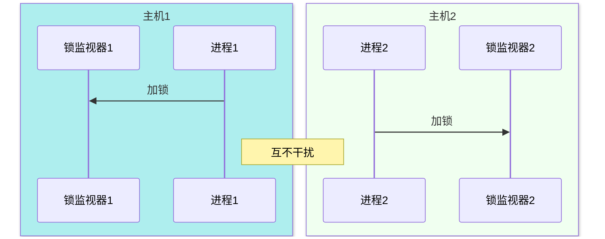

# 分布式集群环境下

以上我们实现了在单个主机的秒杀信息

但是由于`synchronized`基于JVM的锁监视器实现，一个锁监视器只对一个运行环境的JVM生效

如果有多个运行环境，也就是集群多个主机来实现负载均衡，那么每个运行环境的JVM只对它当前的锁监视器管理，多个线程分发给不同的主机，彼此同步运行悲观锁，互不干扰，那么对于我们锁想实现的功能就失效了（不能对分布式系统下`synchronized`实现的锁购买的优惠卷产生锁）

所以我们需要针对分布式系统设置分布式锁

对分布式集群要一个统一管理锁的地方

于是乎  Redis  登场了