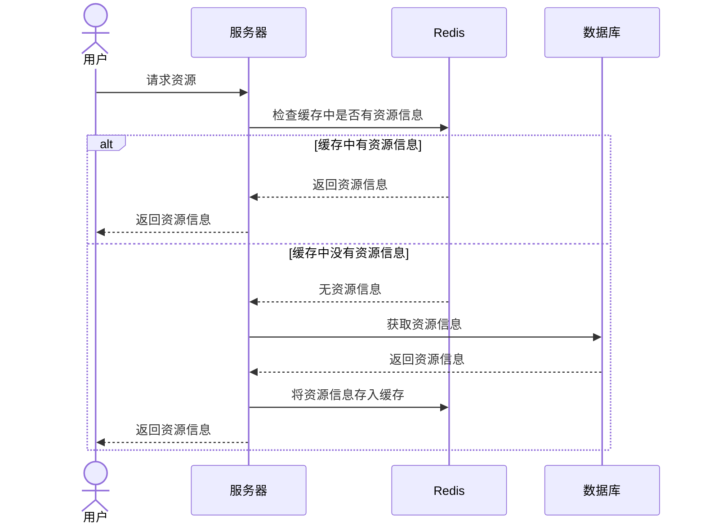

# 缓存常用信息

有这么一类数据，它经常被查询不被删改，对于这类数据在高并发的时候每次都请求一次 sql 服务器容易造成资源浪费，一不小心还容易被干掉

为何不把这一类数据给缓存起来呢

所以我们把这类信息使用 Redis 给缓存起来

## 具体实现

流程：




### 缓存店铺信息

根据黑马点评项目的缓存根据店铺ID的店铺详细信息

```java
    public Result queryById(Long id) {

        String key = RedisConstants.CACHE_SHOP_KEY + id;
        String shopJson = stringRedisTemplate.opsForValue().get(key);
        if (StrUtil.isNotBlank(shopJson)){
            Shop shop = JSONUtil.toBean(shopJson, Shop.class);
            return Result.ok(shop);
        }

        Shop shop = getById(id);
        if (shop == null){
            return Result.fail("店铺不存在");
        }

        stringRedisTemplate.opsForValue().set(key,JSONUtil.toJsonStr(shop),RedisConstants.CACHE_SHOP_TTL, TimeUnit.DAYS);

        return Result.ok(shop);
    }
```

### 缓存店铺分类信息

```java
    public List<ShopType> queryList() throws IOException {

        //查询缓存
        Map<Object, Object> shopTypeMap = stringRedisTemplate.opsForHash().entries(RedisConstants.CACHE_SHOP_TYPE);

        if (!shopTypeMap.isEmpty()) {
            // 将 map 转换为 ShopType 对象列表
            List<ShopType> shopTypeList = new ArrayList<>();
            for (Map.Entry<Object, Object> entry : shopTypeMap.entrySet()) {
                // 将每个 entry 转换为 ShopType 对象
                ShopType shopType = objectMapper.readValue((String) entry.getValue(), ShopType.class);
                shopTypeList.add(shopType);
            }
            shopTypeList.sort(Comparator.comparingInt(ShopType::getSort));
            //击中返回
            log.info("命中缓存");
            return shopTypeList;
        }
        
        //未击中则查询数据库
        List<ShopType> shopTypeList = query().orderByAsc("sort").list();
        
        //写入缓存
        shopTypeList.forEach(shopType -> {
            try {
                String jsonString = objectMapper.writeValueAsString(shopType);
                stringRedisTemplate.opsForHash().put(RedisConstants.CACHE_SHOP_TYPE,shopType.getId().toString(),jsonString);
            } catch (JsonProcessingException e) {
                throw new RuntimeException(e);
            }
        });
        
        return shopTypeList;
    }
```