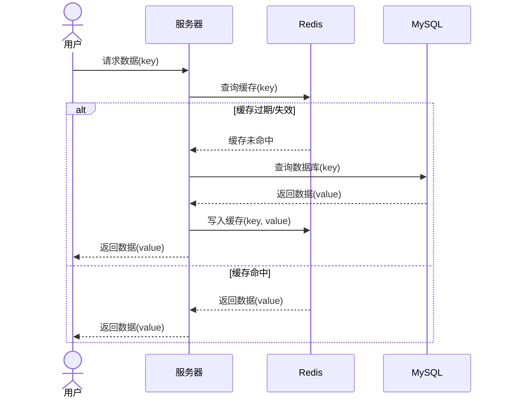

# 缓存击穿

缓存击穿是缓存雪崩的青春版本，一部分key失效了所造成的问题。

但是这一部分的key不是普通的key，是热点key，即被高并发、高访问量的key。

所以缓存击穿又被叫做热点Key问题，当某些高并发、高访问量的key失效并且缓存重建业务复杂在某个时刻失效了，那么大量的请求打在数据库上可能造成程序崩溃。

- [ ] 图重画



### 解决缓存击穿的方法

1. **使用互斥锁**：在缓存失效时，使用互斥锁控制对数据库的访问，防止大量并发请求同时查询数据库。

   ```mermaid
   sequenceDiagram
       actor 用户1
       actor 用户2
       participant 服务器
       participant Redis
       participant MySQL
       
       用户1->>服务器: 请求数据(key)
       
       
       服务器->>Redis: 查询缓存(key)
       
       
       alt 缓存未命中
           Redis-->>服务器: 缓存未命中
           Redis-->>服务器: 缓存未命中
           
           服务器->>服务器: 用户1尝试获取互斥锁
           
           
           alt 用户1获取锁成功
           	用户2->>服务器: 请求数据(key)
           	
           	服务器->>服务器: 用户2尝试获取互斥锁
           alt 用户2获取锁失败
           	服务器->>服务器: 用户2轮询查询缓存(key)
           end
               
               
               服务器->>MySQL: 用户1查询数据库(key)
               MySQL-->>服务器: 返回数据(value)
               服务器->>Redis: 用户1写入缓存(key, value)
               
               服务器->>服务器: 用户1释放互斥锁
            end
           
               服务器-->>用户1: 返回数据(value)
    
               服务器->>服务器: 用户2轮询查询缓存(key)
               Redis-->>服务器: 用户2返回数据(value)
               服务器-->>用户2: 返回数据(value)
           
       else 缓存命中
           Redis-->>服务器: 返回数据(value)
           服务器-->>用户1: 返回数据(value)
           服务器-->>用户2: 返回数据(value)
       end
   
   ```

   这样一来，只会有一个线程在操作数据库，其他的线程在等待缓存构建完成，通过控制并发请求对数据库的访问，防止数据库压力骤增。，且保证了数据一致性，因为同一时间只有一个线程操作数据库

2. **热点数据预热**：在缓存失效前，提前将热点数据重新加载到缓存中，避免缓存过期。

3. **永不过期策略**：对极为重要的热点数据，设置缓存永不过期，并在后台定期更新。

   key永不过期，可以设置逻辑过期

3. **二级缓存**：在本地内存中缓存热点数据，作为Redis缓存的二级缓存，减少对数据库的直接访问。