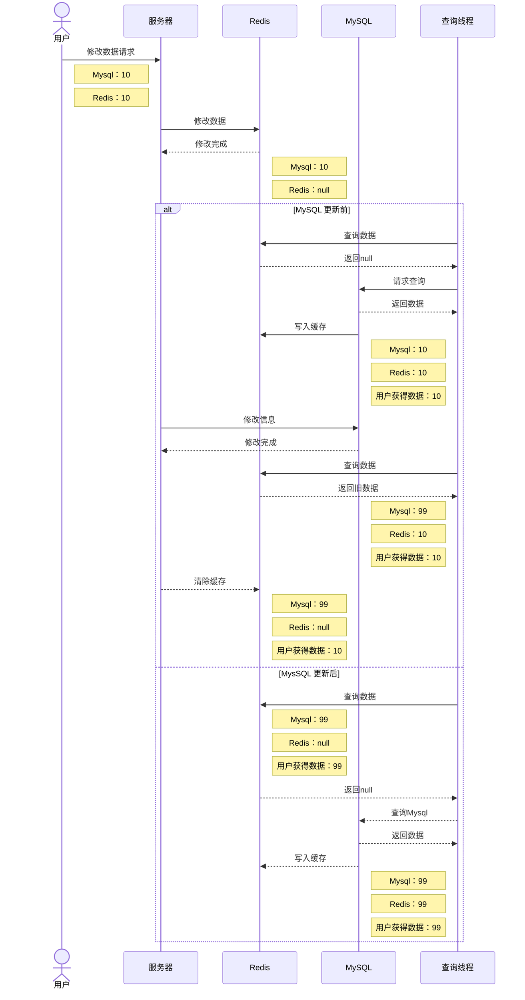
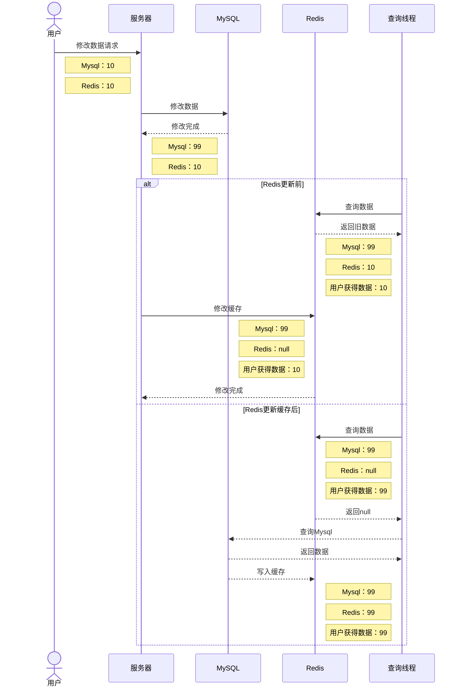
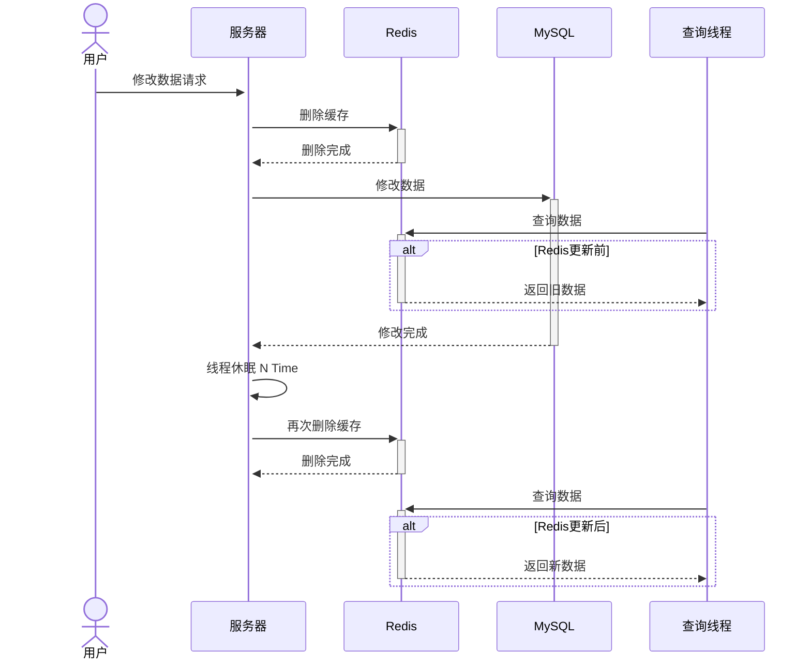
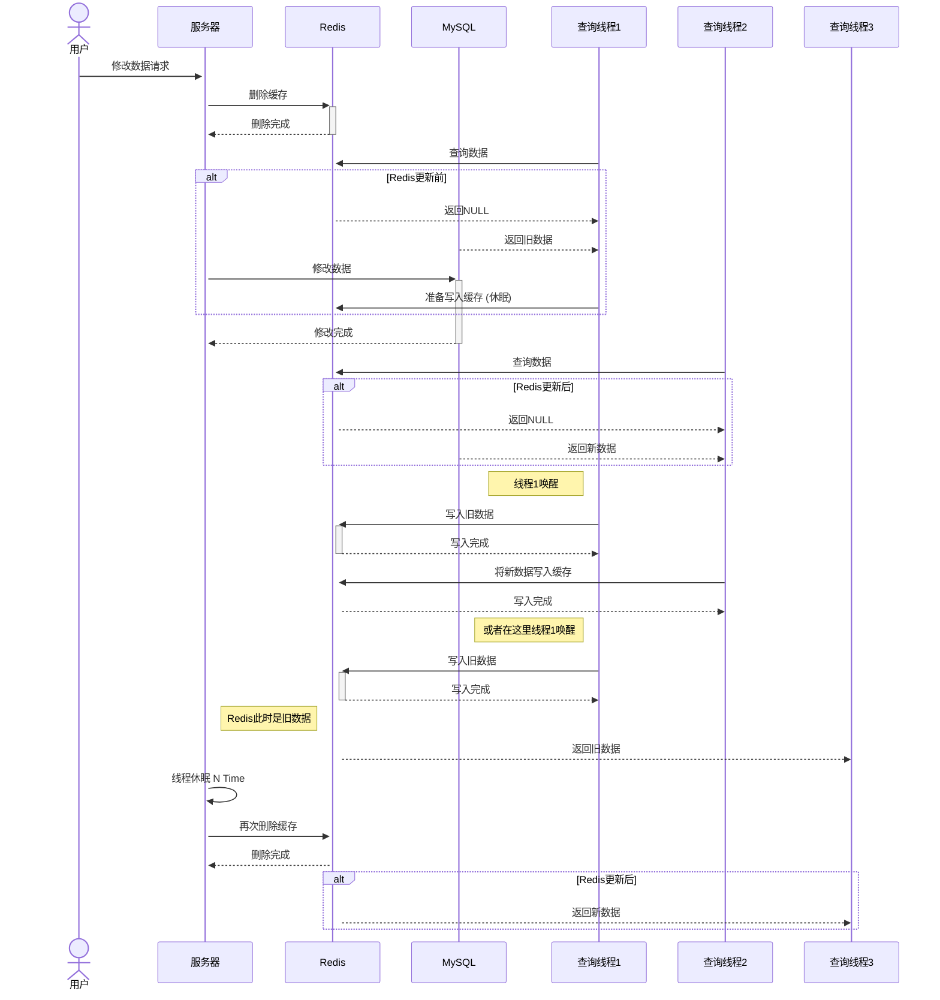

# 缓存更新策略

因为 Redis 只存储一部分数据，与 Mysql 这类的关系型数据库一起使用时，在数据进行的更新时需要保证 双端数据同步

但是在同步数据的时候会出现各种各样的问题造成数据的不同。

|        | 内存淘汰                                                     | 超时剔除                                                     | 主动更新                                        |
| ------ | ------------------------------------------------------------ | ------------------------------------------------------------ | ----------------------------------------------- |
| 作用   | 不用自己维护，使用Redis的内存淘汰机制 内存不足自动淘汰解放某类数据 下次查询自动就更新缓存了 | 对缓存设置有效期 有效期过了之后就会清除缓存 下次查询就自动更新数据 | 在数据更改后手动给缓存数据进行更新              |
| 一致性 | 差，依赖于内存不足才做更新                                   | 一般，依赖于过期时间，不能实时更新数据                       | 基本实现 一致性， 每当数据修改后就更新数据 |

以超时剔除为兜底策略，主动更新为主要策略以应对高一致性的需求

## 主动同步数据的策略

### 同步方式

当数据进行频繁的修改或删除时我们该如何实现Redis的修改

一般有俩种解决方式：

1. 每次修改同步在Redis进行修改
2. 关系型数据库进行修改时，在Redis删除原先缓存，下次查询缓存未命中时再次加载缓存

::: tip 提示
一般的如果缓存记录的元素多次修改，缓存也多次修改造成资源浪费

所以可以选择删除缓存，这样只需要记录最后一次改变的情况就能实现缓存的更新
:::

### 同步顺序

在数据产生要发生修改的时候

Mysql 和 Redis 处于未修改状态 对于单线程来说 Redis和MySql的修改顺序是有一个先后顺序的

那么是先修改 Redis 还是先修改 Mysql 呢？

----

#### 先进行 Redis 的修改 时

:::danger 提示

在这一段流程中，如果有一个第三线程进来查询就会产生多次数据不一致的情况

不建议使用这种方式

:::

----

#### 先进行 Mysql 的修改 时

::: tip

我们可以看出在修改Mysql后没能把Redis缓存删除的时间间隙

如果有一个线程来获取数据则会造成数据的不一致获取到错误数据

但是由于Redis速度快性能好这一特点造成这种情况的时间间隙是毫秒级别，基本不会出现这种情况

:::

可以应对大部分业务情况

----

#### 延时双删

延时双删指的是在数据发生改变后删除缓存，接着删除数据库，线程休眠 N Time，再执行一次删除缓存的操作

本来以为这种方法再解决问题的处理上很鸡肋，如果时间设置的不是很长，数据库没有操作完毕就跟没删一样，要是时间间隔很长，缓存在这段时间（数据库没有完成更改）后被请求的话还是旧数据。

我认为这种情况解决的是第一次查询线程查询后从Mysql取出信息后，准备写入Redis的时候因为某种原因休眠了，再新数据进入Redis时又被唤醒，导致旧数据覆盖了新数据造成的不一致......其他业务情况不清楚

::: tip 提示

但是由于间隔时间的设置或快或慢并不能完全解决不一致问题

:::

---

#### 其他

要想更完美的解决一致性问题，可以考虑分布式锁，单线程队列之类的方式解决

