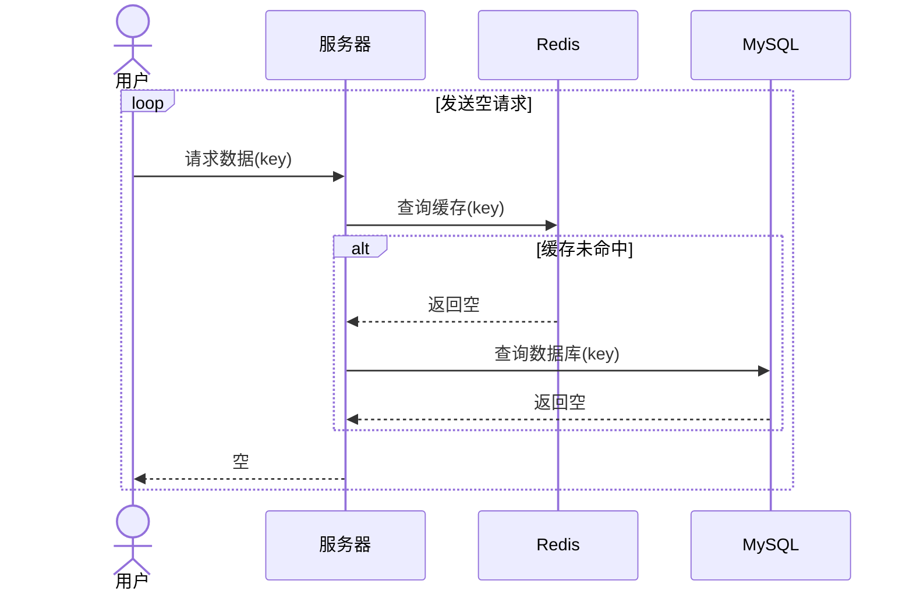

# 缓存穿透

## 原理

缓存穿透的解释 ：

客户端请求的数据在 Redis 和 数据库都不存在，从Redis和数据库通通击透。缓存永远不会生效，请求打到数据库中。



如果有大量的此类无效请求打到数据库会把数据库给打宕机！

## 常见解决方案：

1. 缓存空对象

   对于数据库中没有的数据创建一个空对象，客户端发来的请求通通由这个空对象返回回去，从而不会把请求打到数据库

   ```mermaid
   sequenceDiagram
       actor 用户
       participant 服务器
       participant Redis
       participant MySQL
       用户->>服务器: 请求数据(key)
       服务器->>Redis: 查询缓存(key)
       alt 缓存未命中
           Redis-->>服务器: 返回空
           服务器->>MySQL: 查询数据库(key)
           MySQL-->>服务器: 返回空
           服务器->>Redis: 写入空结果(key)
           服务器-->>用户: 返回空结果
       else 缓存命中
           Redis-->>服务器: 返回数据(value)
           服务器-->>用户: 返回数据(value)
       end
   
   ```
   优点：简单实现，维护容易
   
   缺点：
   
   - 占用内存
     解决方案：设置TTL过期时间
   - 短期不一致
     如果此时Redis是空对象，那么新增新的对象则数据库和缓存造成不一致的现象，等TTL过期才能后一致
     解决方案：设置新增加对象时，覆盖Redis的空对象
   
2. 布隆过滤器

   在Redis和客户端之间设置一个布隆过滤器，把空对象无效请求处理掉，让它不能到达Redis

   原理：布隆过滤器是一串二进制字符，存储着由哈希函数计算出来的hash数组，记录着元素是否存在集合中的数值，是一种空间效率高、查询速度快的概率型数据结构
   
   ```mermaid
   sequenceDiagram
       actor 用户
       participant 服务器
       participant 布隆过滤器
       participant Redis
       participant MySQL
       用户->>服务器: 请求数据(key)
       服务器->>布隆过滤器: 检查布隆过滤器(key)
       alt 布隆过滤器认为存在
           布隆过滤器-->>服务器: 可能存在
           服务器->>Redis: 查询缓存(key)
           alt 缓存未命中
               Redis-->>服务器: 返回空
               服务器->>MySQL: 查询数据库(key)
               MySQL-->>服务器: 返回数据(value)
               服务器->>Redis: 写入缓存(key, value)
               服务器-->>用户: 返回数据(value)
           else 缓存命中
               Redis-->>服务器: 返回数据(value)
               服务器-->>用户: 返回数据(value)
           end
       else 布隆过滤器认为不存在
           布隆过滤器-->>服务器: 不存在
           服务器-->>用户: 返回空结果
       end
   ```
   
   优点：内存占用少，只是一串二进制数组，没有多余的key
   
   缺点：会误判存在，实现复杂
   
3. 做好数据基本的校验

4. 加强用户权限管理与校验

5. 做好热点参数的限流

6. 增强key值或id的复杂度，避免被猜测规律

## 实现

### 实现空对象缓存

在原有的查询 Redis 缓存的基础上加上两个步骤：

1. 判断对象不存在时把空对象写入Redis并返回，并设置过期时间
2. 在缓存命中后如果缓存的值为NULL，则直接返回

```java{10-13,16-20}
public Result queryById(Long id) {

    String key = RedisConstants.CACHE_SHOP_KEY + id;
    String shopJson = stringRedisTemplate.opsForValue().get(key);
    //判断是否存在 NULL不成立
    if (StrUtil.isNotBlank(shopJson)){
        Shop shop = JSONUtil.toBean(shopJson, Shop.class);
        return Result.ok(shop);
    }
    //命中缓存，店铺为空时
    if (shopJson != null){
        return Result.fail("店铺不存在");
    }

    Shop shop = getById(id);
    //对象为空
    if (shop == null){
        stringRedisTemplate.opsForValue().set(key,"",RedisConstants.CACHE_NULL_TTL, TimeUnit.MINUTES);
        return Result.fail("店铺不存在");
    }

    stringRedisTemplate.opsForValue().set(key,JSONUtil.toJsonStr(shop),RedisConstants.CACHE_SHOP_TTL, TimeUnit.DAYS);

    return Result.ok(shop);
}
```

::: tip 提示

可以在新增对象时，加入缓存覆盖

:::