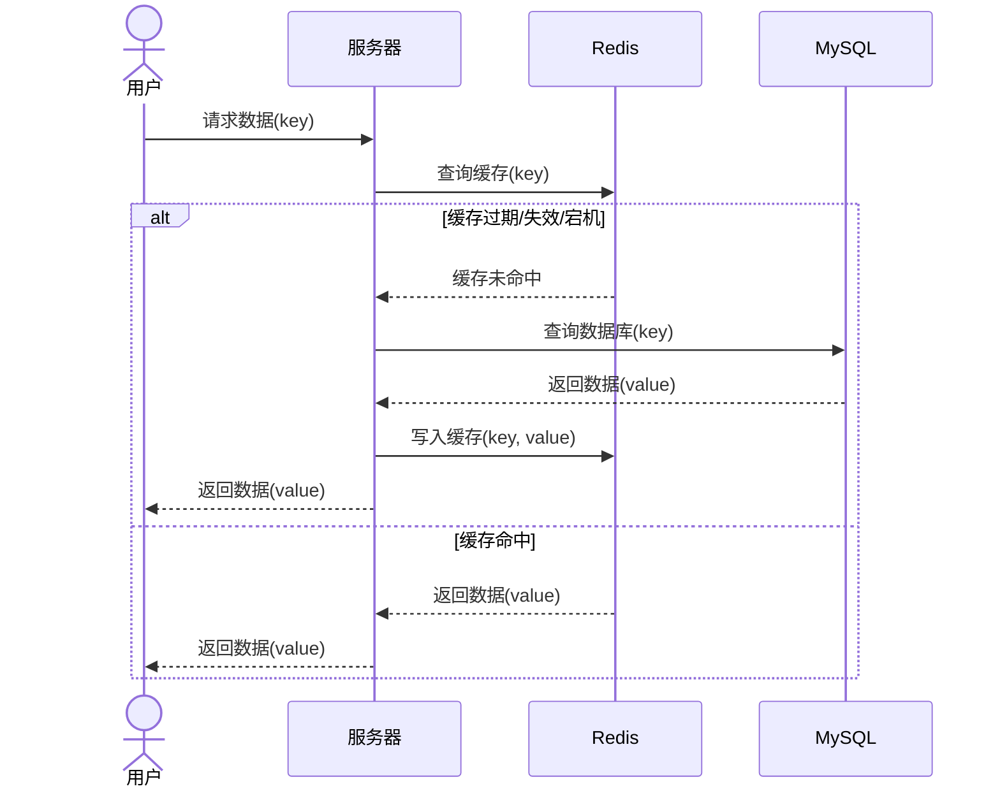

# 缓存雪崩

缓存雪崩指的是在某一时间点，缓存中大量的数据同时失效或过期，导致大量请求直接打到数据库，瞬间给数据库带来巨大压力，可能导致系统崩溃。通常，这种情况发生在大规模缓存应用中，如果缓存服务器重启或大量缓存数据设置了相同的过期时间，就会出现缓存雪崩。

如果是Redis宕机，情况会更加严重，不只是一部分数据没有缓存而是全部数据丢失缓存 ，更严重的后果是 查询数据库后没有缓存可以设置，请求将全部且多次重复的打在数据库上 。

解决方案：

- **设置随机时间**：对于大量key同时过期，对不同的key设置随机数，让它们不在同一时间失效
- **设置Redis集群**：对于Redis宕机，设置Redis集群，单个Redis服务器宕机会有其他Redis服务器补上
- **限流和降级**：在缓存失效时，对访问数据库的请求进行限流，或返回一些默认值或降级服务，保护数据库。
- **多级缓存**：在本地内存中保存部分热点数据，作为Redis缓存的多级缓存。浏览器、客户端、NGINX、本地.....都可以做多级缓存

设置随机时间示例：`stringRedisTemplate.opsForValue().set(key,JSONUtil.toJsonStr(shop),RedisConstants.CACHE_SHOP_TTL+ RandomUtil.randomLong(5,30), TimeUnit.MINUTES);`