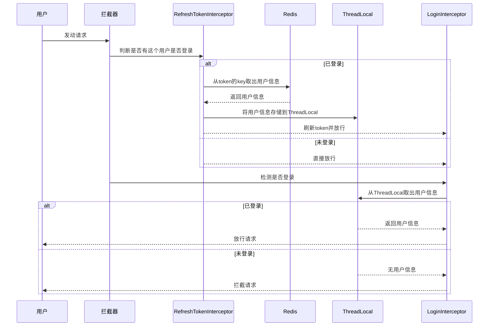

# 缓存登录验证

## 目标

1. 实现登录验证码存入redis，设置验证码过期时间
2. 登录验证读取验证码
3. 存入token，请求其他非登录请求时读取token的身份信息验证是否登录，并设置Token过期时间为30分钟
4. Redis的token每发送一次请求自动把过期时间再次设置为30分钟


## 实现

1. 实现登录验证码存入redis，设置验证码过期时间

2. 登录验证读取验证码

3. 存入token，请求其他非登录请求时读取token的身份信息验证是否登录，并设置Token过期时间为30分钟
	```java
       public Result login(LoginFormDTO loginForm, HttpSession session){
   
   
           String phone = loginForm.getPhone();
   
           // 手机号格式校验
           if (RegexUtils.isPhoneInvalid(phone)){
               return Result.fail("手机号码格式错误！");
           }
   
           // 取出缓存中的验证码
           String cacheCode = stringRedisTemplate.opsForValue().get(RedisConstants.LOGIN_CODE_KEY + phone);
   
   
           String code = loginForm.getCode();
   
           if (cacheCode==null || !cacheCode.toString().equals(code)){
               return Result.fail("验证码错误");
           }
   
           //从数据库中读取信息
           User user = query().eq("phone", phone).one();
   
           if (user==null){
               user = createUserWithPhone(phone);
           }
   
           //随机生成Token
           String token = UUID.randomUUID().toString();
           UserDTO userDTO = BeanUtil.copyProperties(user, UserDTO.class);
           Map<String, Object> userMap = BeanUtil.beanToMap(userDTO,new HashMap<>(),
                   CopyOptions.create()
                   .setIgnoreNullValue(true)
                   .setFieldValueEditor((filedName,filedValue)->filedValue.toString()));
   
   
           
           // 以 token 为 key 存 到 redis
           stringRedisTemplate.opsForHash().putAll(RedisConstants.LOGIN_USER_KEY+token,userMap);
           //设置过期时间
           stringRedisTemplate.expire(RedisConstants.LOGIN_USER_KEY+token,RedisConstants.LOGIN_USER_TTL,TimeUnit.MINUTES);
   
           return Result.ok(token);
	       }
	```
	设置拦截器，为未登录情况下无token这个key时（黑马点评使用的是ThreadLocal）（可以使用双层验证更安全...），自动跳转登录界面，
	
4. Redis的token每发送一次请求自动把过期时间再次设置为30分钟
	```java
	public class RefreshTokenInterceptor implements HandlerInterceptor {
   
    StringRedisTemplate stringRedisTemplate;
   
    public RefreshTokenInterceptor(StringRedisTemplate stringRedisTemplate) {
        this.stringRedisTemplate = stringRedisTemplate;
    }
   
    @Override
    public boolean preHandle(HttpServletRequest request, HttpServletResponse response, Object handler) throws Exception {
        //获取token
        String token = request.getHeader("authorization");
   
        if (StrUtil.isBlank(token)){
            return  true;
        }
        //获取Key
        String key = RedisConstants.LOGIN_USER_KEY + token;
        //获取用户
        Map<Object, Object> user = stringRedisTemplate.opsForHash().entries(key);
   
        if (user.isEmpty()){
            return true;
        }
        //刷新token的有效期
        UserDTO userDTO = BeanUtil.fillBeanWithMap(user, new UserDTO(), false);
        UserHolder.saveUser( userDTO);
        stringRedisTemplate.expire(key, RedisConstants.LOGIN_USER_TTL, java.util.concurrent.TimeUnit.MINUTES);
        return  true;
    }
   ```
	::: tip 提示
	该系统使用俩个拦截器实现这个功能
	
	:::
```java
    public void addInterceptors(InterceptorRegistry registry) {
        registry.addInterceptor(new LoginInterceptor())
//                .addPathPatterns("/**")
                .excludePathPatterns(
                        "/user/code",
                        "/user/login",
                        "/blog/hot",
                        "/shop/**",
                        "/shop-type/**",
                        "/upload/**",
                        "/voucher/**"
                ).order(1);
        registry.addInterceptor(new RefreshTokenInterceptor(stringRedisTemplate))
                .addPathPatterns("/**").order(0);
    }
```




