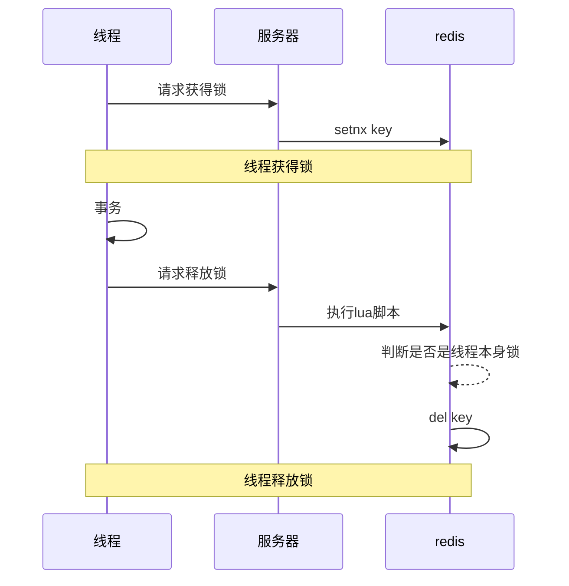
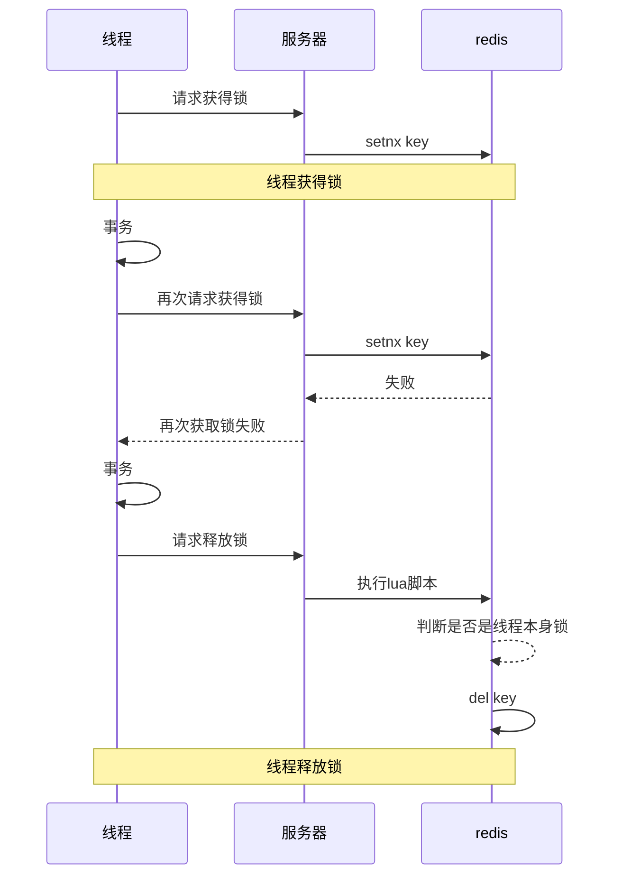
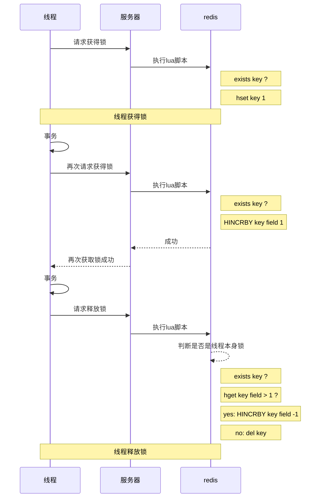

# 不可重入以及原理

## 问题

不可重入是指一个线程一个锁获得锁后只能获得一次，当有其他业务时想再次获得锁的时候会失败。

即原来的流程是：



我要在线程有锁的情况下再次请求锁，这个时候服务器判断以及存在锁了，拒绝了这个请求，这就是不可重入



因为原先的方法不可重入锁，会有一定的可能性造成事务错误！

那么该如何解决呢

## 解决

如果有一个东西可以记录是否存在这个锁，并记录这个锁的个数，在释放锁的时候进行判断锁的个数，如果不为0则-1，如果为0则删除key，那么这样就可以实现锁的可重入！




redis有俩个基本类型既能记录key 的值，又可以记录个数，一个是Hash，一个是ZSet(有序集合)。

以Hash来做实现的方案

::: code-group

```lua[获取锁]
local key = KEYS[1]      -- key
local threadId = ARGV[1]  -- 线程唯一标识
local releaseTime = ARGV[2] --自动释放时间

--判断锁是否是存在
if (redis.call('EXISTS',key)==0) then
    --不存在则获取锁并设置有效期
    redis.call('hset',key,threadId,'1')
    redis.call('EXPIRE',key,releaseTime)
    return 1;
end

-- 锁已存在判断是否属于自己
if (redis.call('hexists',key,threadId)==1) then
    -- 重入次数+1
    redis.call("HINCRBY",key,threadId,1)
    --重置有效期
    redis.call('EXPIRE',key,releaseTime)
end
```


```lua[释放锁]
local key = KEYS[1]      -- key
local threadId = ARGV[1]  -- 线程唯一标识
local releaseTime = ARGV[2] --自动释放时间

--判断锁是否是自己的
if (redis.call('HEXISTS',key,threadId)==0) then
    return nil;
end

local count = redis.call("HINCRBY",key,threadId,-1)--如果是自己的锁就-1

if (count>0) then
    redis.call('EXPIRE',key,releaseTime)--重置有效期，因为是新事务的锁
    return nil
else
    redis.call('del',key)--没锁了可以删除了
    return nil
end

```

:::

## Redission实现不可重用

redission继承实现解决了不可重用，底层原理就是lua脚本实现以上原理

追踪源码就能看见：

tryLock的时候


```java
    <T> RFuture<T> tryLockInnerAsync(long waitTime, long leaseTime, TimeUnit unit, long threadId, RedisStrictCommand<T> command) {
        return this.evalWriteAsync(this.getRawName(), LongCodec.INSTANCE, command, 
                                   "if (redis.call('exists', KEYS[1]) == 0) then redis.call('hincrby', KEYS[1], ARGV[2], 1); redis.call('pexpire', KEYS[1], ARGV[1]); return nil; end; if (redis.call('hexists', KEYS[1], ARGV[2]) == 1) then redis.call('hincrby', KEYS[1], ARGV[2], 1); redis.call('pexpire', KEYS[1], ARGV[1]); return nil; end; return redis.call('pttl', KEYS[1]);",
                                   Collections.singletonList(this.getRawName()), new Object[]{unit.toMillis(leaseTime), this.getLockName(threadId)});
    }
```


