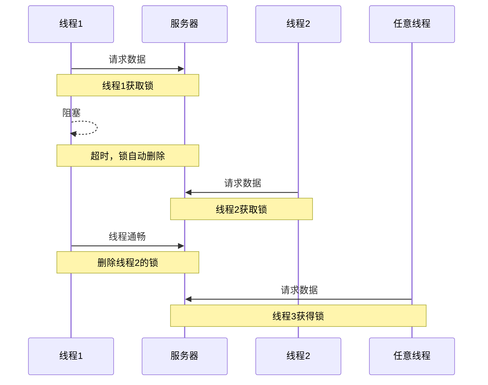

# 分布式锁

分布式锁：满足分布式系统或集群模式下的多进程可见且互斥的锁

有以下要求或特点：

- 多线程可见
- 高可用
- 互斥
- 高性能
- 安全性
- .....其他功能性特性(附加功能)

实现分布式锁的常用方法：

|          | Mysql                 | Redis                                         | Zookeeper                                  |
| -------- | --------------------- | --------------------------------------------- | ------------------------------------------ |
| 互斥原理 | 利用事务特性 的互斥锁 | setnx类似命令，设置key为加锁，删除key为释放锁 | 利用节点的唯一性和有序性实现互斥(类似队列) |
| 高可用   | 好                    | 好                                            | 好                                         |
| 性能     | 一般                  | 高                                            | 一般，消耗时间                             |
| 安全     | 断开连接，自动释放锁  | TTL设置过期自动释放锁                         | 临时节点，断开连接自动释放                 |

---

## Redi的实现

### 获取锁

- 使用命令`Set key value NX EX TTL`
- 非阻塞：获取成功返回True，失败返回False

### 释放锁

- 删除key`DELETE key`

- 超时释放

### 代码实现

实现redis工具类，实现加锁和释放锁的功能

```java{16-23,27-30}
public class SimpleRedisLock implements ILock{


    public SimpleRedisLock(StringRedisTemplate stringRedisTemplate, String name) {
        this.stringRedisTemplate = stringRedisTemplate;
        this.name = name;
    }

    private  StringRedisTemplate stringRedisTemplate;

    private  String name;
    
    private static final String KEY_PREFIX = "lock:";

    @Override
    public boolean tryLock(Long timeoutSec) {
        //设置key
        String key = KEY_PREFIX + name;
        //存储线程id
        Long id = Thread.currentThread().getId();
        Boolean sussess =  stringRedisTemplate.opsForValue().setIfAbsent(key,id+"",timeoutSec, TimeUnit.SECONDS);
        //防止出现错误
        return Boolean.TRUE.equals(sussess);
    }

    @Override
    public void unlock() {
        String key = KEY_PREFIX + name;
        stringRedisTemplate.delete(key);
    }
}
```

改造之前的单机悲观锁

::: code-group 代码组

```java[新版]
SimpleRedisLock simpleRedisLock = new SimpleRedisLock(stringRedisTemplate, "order:"+userId.getId());
//获取锁并设置过期时间
boolean isLock = simpleRedisLock.tryLock(500L);

if (!isLock){
    //获取锁失败
    return Result.fail("同一个用户只能下一单");
}
//如果不是阻止别人只下一单，而是之前解决超卖问题的话，需要休眠或者重复请求
try {
    //执行逻辑
    IVoucherOrderService proxy = (IVoucherOrderService) AopContext.currentProxy();
    return proxy.createVoucherOrder(voucherId);
}finally {
    simpleRedisLock.unlock();
}
```

```java[旧版]
       synchronized (userId.getId().toString().intern()) {
           IVoucherOrderService proxy = (IVoucherOrderService) AopContext.currentProxy();
           return proxy.createVoucherOrder(voucherId);
       }
```

:::

### 错删问题

正常情况下可以应对大部分情况，但是有一些极限情况会造成错误，分布式锁出现问题

异常情况下，进程1堵塞，导致时间过期锁自动释放，此时进程2进来执行流程上锁，进程1执行完毕把进程2的锁删除，此时任意进程都可以获取锁，对于业务来说很混乱很爆炸，这就是错删问题



解决办法：给每个锁一个特定的ID，当服务器接收到释放锁的信号时辨认这个锁是否属于该线程，是的话才能释放锁，否则返回错误或者进入等待。

代码改进方案：使用UUID和线程id共同使用，避免分布式系统不同的主机的线程id由于自增长导致id相同的情况

```java{11,17,16,25,27,28,29,30,31}
public SimpleRedisLock(StringRedisTemplate stringRedisTemplate, String name) {
    this.stringRedisTemplate = stringRedisTemplate;
    this.name = name;
}

private  StringRedisTemplate stringRedisTemplate;

private  String name;
private static final String KEY_PREFIX = "lock:";

private static final String ID_PREFIX = UUID.randomUUID().toString(true)+"-";

@Override
public boolean tryLock(Long timeoutSec) {
    String key = KEY_PREFIX + name;
    String id = ID_PREFIX+Thread.currentThread().getId();
    Boolean sussess =  stringRedisTemplate.opsForValue().setIfAbsent(key,id,timeoutSec, TimeUnit.SECONDS);
    return Boolean.TRUE.equals(sussess);
}

@Override
public void unlock() {

    String key = KEY_PREFIX + name;
    String id = stringRedisTemplate.opsForValue().get(key);

    String threadID = ID_PREFIX + Thread.currentThread().getId();
    if (threadID.equals(id)){
        //相等时
        stringRedisTemplate.delete(key);
    }
}
```

这样就能实现分布式锁了