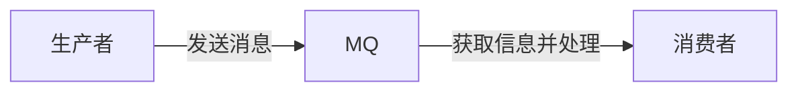
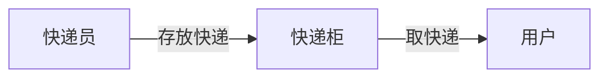

# 消息队列

Message Queue ，MQ的缩写，消息队列，存放消息的队列

消息队列基本模型的三个角色

生产者：发送消息到消息队列

消费者：从消息队列获取信息并处理

消息队列：存储和管理信息，被称为消息代理（Message Broker)

Redis有三种不同的方式实现消息队列

- List：使用list结构模拟队列，即先进先出
- PubSub：基本的点对点消息模型
- Stream: 提供比较完善的消息队列模型