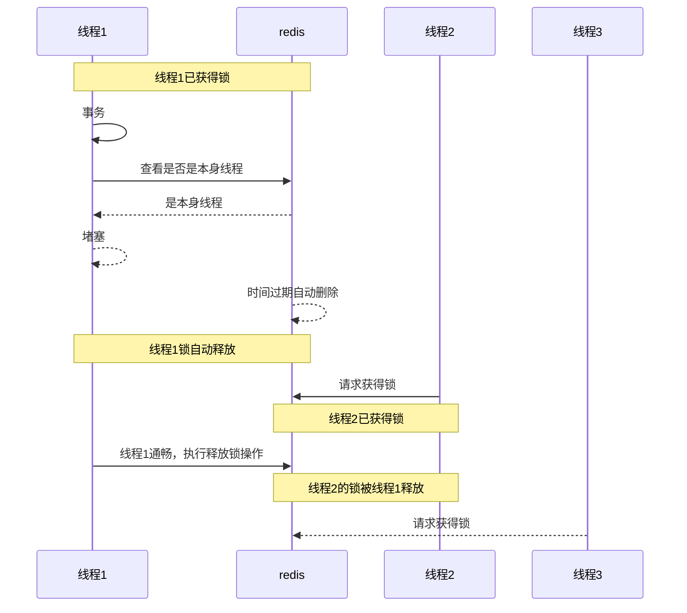

# 原子性与Lua脚本

我用在前面使用Redis造的分布式锁之中，我们是先取出存储在redis的锁来判断是否是否与原来的锁一致，锁一致再进行删除

我们发现判断锁是否一致和释放锁其实是两步操作，在这个过程中极端情况下先获取自己本身的锁，准备删除遇到线程堵塞后，

redis时间过期自动删除原本的锁，另外一个线程此时进来获取锁，此时原来的线程通畅了又把原来不属于自己的锁给删除了




这个过程没有原子性，要想解决这个问题，我们需要把这个几步流程变为一个流程

## 在lua脚本

在lua脚本的流程如下

```lua
-- 锁的key
local key = KEYS[1]

--线程号
local threadID = ARGV[1]

--获取锁中线程标示
local id = redis.call('get',threadID)

--比较是否一致
if (id==threadID) then
    -- 一致则释放锁
    return redis.call('del',key)
end
-- 不一致返回0
return 0
```

简化流程

```lua

--比较是否一致
if ( redis.call('get',ARGV[1])==ARGV[1]) then
    -- 一致则释放锁
    return redis.call('del',KEYS[1])
end
-- 不一致返回0
return 0
```

