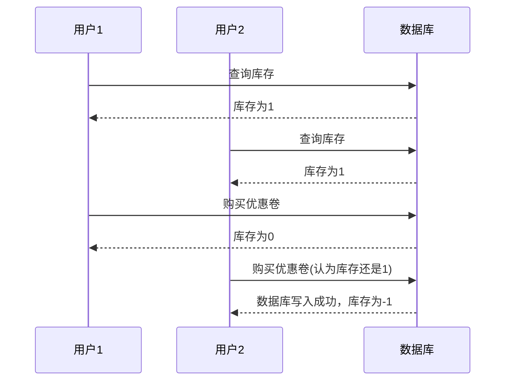
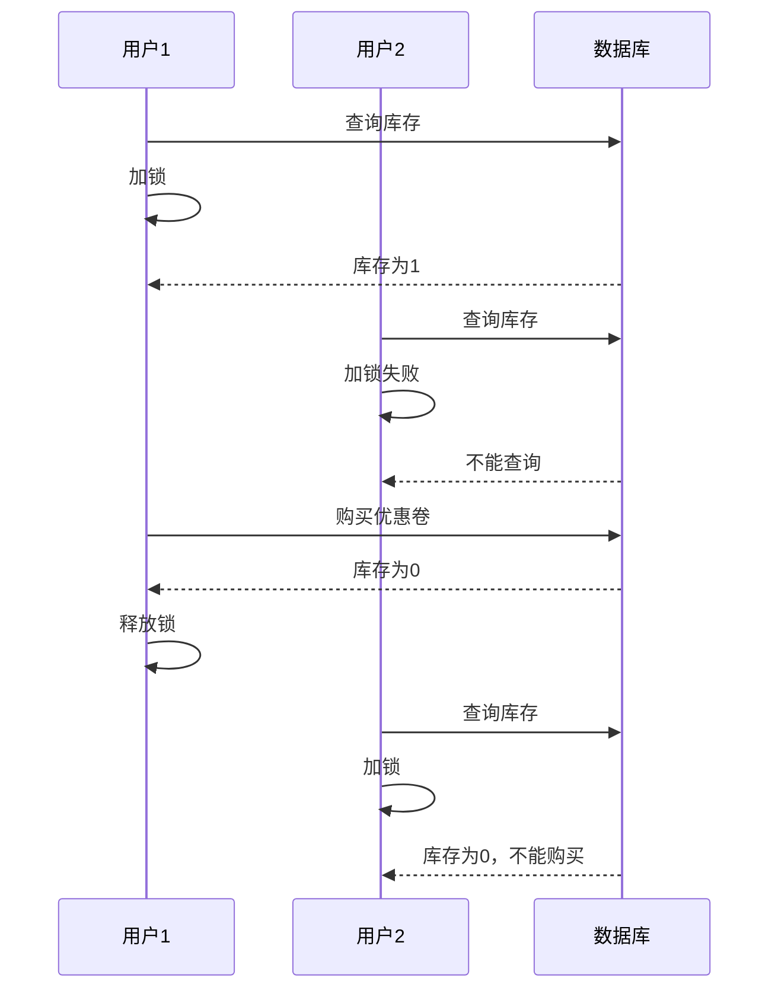

# 秒杀的实现与优化


## 秒杀优惠卷下单

实现方式

```java
@Transactional
public Result seckillVoucher(Long voucherId) {
    //查询优惠卷
    SeckillVoucher voucher = seckillVoucherService.getById(voucherId);
    //判断秒杀是否在时间范围内
    LocalDateTime beginTime = voucher.getBeginTime();
    LocalDateTime endTime = voucher.getEndTime();
    if (LocalDateTime.now().isBefore(beginTime) || LocalDateTime.now().isAfter(endTime)) {
        return Result.fail("秒杀时间未到");
    }
    //判断库存是否充足
    if (voucher.getStock() < 1) {
        return Result.fail("库存不足");
    }
    //秒杀卷库存 -1

    boolean success = seckillVoucherService.update()
            .setSql("stock = stock - 1")
            .eq("voucher_id", voucherId).update();
    //创建新订单
    if (!success){
        return Result.fail("库存不足");
    }

    //订单号
    long order = redisIdWorker.nextId("order");

    VoucherOrder voucherOrder = VoucherOrder.builder()
            .userId(UserHolder.getUser().getId())
            .voucherId(voucherId)
            .id(order)
            .build();

    save(voucherOrder);

    return  Result.ok(order);
}
```


## 超卖问题

多线程高并发的环境下，某个线程查询数据库存依旧存在 ，这时候另一线程进行交易导致库存为0，而原先的线程并不知道，也进行了交易

结果就是在库存已经卖完的情况下线程依旧买到了优惠卷，造成了超卖现象




### 乐观锁与悲观锁


|      | 乐观锁                                                       | 悲观锁                                                       |
| ---- | ------------------------------------------------------------ | ------------------------------------------------------------ |
| 解释 | 很乐观的认为线程安全问题并不一定会发生，<br />只在更新数据的时候判断数据是否有其他线程已经改变数据<br />未发生改变说明正常线程安全更新数据<br />如果 数据发送改变此时发生安全问题，报出异常 | 悲观的认为一定会出现安全问题<br />操作数据时获取锁<br />使线程获得锁确保串行执行<br />Synchronized、Lock为悲观锁 |


### 悲观锁解决超卖

可以仿照解决缓存击穿的方法，添加互斥锁，让同一时间操作查询库存-->秒杀优惠卷的流程只有一个线程进行操作

可以完美解决超卖问题，但是性能不佳,容易阻塞线程




> 除了redis互斥锁还有多种解决方案添加悲观锁


### 乐观锁解决超卖

- 版本号法

  在数据每次发生改变后修改版本号，读取库存后记录版本号，在交易时判断库存版本号是否发生改变

  如果发生改变则代表其他线程进行交易，从而达到锁的思路
  
  ```java
      boolean success = seckillVoucherService.update()
              .setSql("stock = stock - 1")
         		.setSql("version = version+1")  //set new_version = old_version +1
              .eq("voucher_id", voucherId)
              .eq("version",voucher.getVersion()) //where version = version_old
              .update();
  ```


- CAS法

  因为版本号在每次执行时都会发生改变，库存也在发生改变，改变的幅度一致

  以库存来当作版本号实现乐观锁

  ```java{4}
          boolean success = seckillVoucherService.update()
                  .setSql("stock = stock - 1")
                  .eq("voucher_id", voucherId)
                  .eq("stock",voucher.getStock())
                  .update();
  ```

  此时库存与原先查询时保持一致就可以确保没有被修改

  ::: tip 新问题

  这个方法在高并发的时候依旧会有线程因为同时 读取库存，但是由于某个线程进行交易后导致数据不一致 （库存不一致），从而导致交易失败

  ```mermaid
  sequenceDiagram
    participant  1 as 用户1
    participant 2 as 用户2
    participant db as 数据库
  
    1->>db: 查询库存
    db-->>1: 库存为1
    2->>db: 查询库存
    db-->>2: 库存为1
    1->>db: 购买优惠卷
    db-->>1: 库存为0
    2->>db: 购买优惠卷(认为库存还是1)
    db-->>2: 写入失败，查询的库存为1，购买时库存已经为0
  ```
  
  
  
  :::
  
  改进：我只要判断在数据库中是否库存大于0即可
  
  ```java{4}
          boolean success = seckillVoucherService.update()
                  .setSql("stock = stock - 1")
                  .eq("voucher_id", voucherId)
                  .gt("stock", 0)//  stock > 0
                  .update();
  ```

---

::: danger 提示

乐观锁在提高性能的同时也带来了成功率低这问题，可以使用更多方法解决

例如分表进行分段锁，100个资源分成10个表，每个表控制 的资源少了操作异常的可能性也少了

:::

### 一人一单

秒杀优惠卷一般限制一个人不能购买太多

一般只能一人一单

::: info 虽然

虽然我觉得这个直接加入唯一约束就可以解决问题了,但是有一些优惠卷限制五张等等又不能实现功能了

:::

代码实现：

```java{15-23}
@Transactional
  public Result seckillVoucher(Long voucherId) {
        //查询优惠卷
        SeckillVoucher voucher = seckillVoucherService.getById(voucherId);
        //判断秒杀是否在时间范围内
        LocalDateTime beginTime = voucher.getBeginTime();
        LocalDateTime endTime = voucher.getEndTime();
        if (LocalDateTime.now().isBefore(beginTime) || LocalDateTime.now().isAfter(endTime)) {
            return Result.fail("秒杀时间未到");
        }
        //判断库存是否充足
        if (voucher.getStock() < 1) {
            return Result.fail("库存不足");
        }

		//判断订单是否存在
        UserDTO userId = UserHolder.getUser();
        Integer count = query().eq("user_id", userId.getId())
                .eq("voucher_id", voucherId)
                .count();
        if (count > 0){
            //用户已购买
            return Result.fail("不能重复下单");
        }

        //秒杀卷库存 -1
        boolean success = seckillVoucherService.update()
                .setSql("stock = stock - 1")
                .eq("voucher_id", voucherId)
//                .eq("stock",voucher.getStock())
                .gt("stock", 0)
                .update();

        //创建新订单
        if (!success){
            return Result.fail("库存不足");
        }


        //订单号
        long order = redisIdWorker.nextId("order");

        VoucherOrder voucherOrder = VoucherOrder.builder()
                .userId(userId.getId())
                .voucherId(voucherId)
                .id(order)
                .build();

        save(voucherOrder);

        return  Result.ok(order);
    }
```

但是这种情况 会在高并发的时候产生问题，只要用户请求足够快，在没写入第一张优惠卷购买时，其他线程又进行了优惠卷购买记录的查询发现是0，导致购买次数超过1

这个时候可以加上悲观锁来实现数据一致性

```java{16-18,22}
public Result seckillVoucher(Long voucherId) {
        //查询优惠卷
        SeckillVoucher voucher = seckillVoucherService.getById(voucherId);
        //判断秒杀是否在时间范围内
        LocalDateTime beginTime = voucher.getBeginTime();
        LocalDateTime endTime = voucher.getEndTime();
        if (LocalDateTime.now().isBefore(beginTime) || LocalDateTime.now().isAfter(endTime)) {
            return Result.fail("秒杀时间未到");
        }
        //判断库存是否充足
        if (voucher.getStock() < 1) {
            return Result.fail("库存不足");
        }
        UserDTO userId = UserHolder.getUser();

        synchronized (userId.getId().toString().intern()) {
            IVoucherOrderService proxy = (IVoucherOrderService) AopContext.currentProxy();
            return proxy.createVoucherOrder(voucherId);
        }
    }

    @Transactional
    public  Result createVoucherOrder(Long voucherId) {
        UserDTO userId = UserHolder.getUser();
        Integer count = query().eq("user_id", userId.getId())
                .eq("voucher_id", voucherId)
                .count();
        if (count > 0){
            //用户已购买
            return Result.fail("不能重复下单");
        }

        //秒杀卷库存 -1
        boolean success = seckillVoucherService.update()
                .setSql("stock = stock - 1")
                .eq("voucher_id", voucherId)
//                .eq("stock",voucher.getStock())
                .gt("stock", 0)
                .update();

        //创建新订单
        if (!success){
            return Result.fail("库存不足");
        }
        
        //订单号
        long order = redisIdWorker.nextId("order");
        VoucherOrder voucherOrder = VoucherOrder.builder()
                .userId(userId.getId())
                .voucherId(voucherId)
                .id(order)
                .build();
        save(voucherOrder);
        return  Result.ok(order);
    }
```

代理对象暴露需要加入依赖

```xml
    <dependency>
        <groupId>org.aspectj</groupId>
        <artifactId>aspectjweaver</artifactId>
    </dependency>
```

启动类加上配置注解

```java{2,3}
@MapperScan("com.hmdp.mapper")
//暴露代理对象
@EnableAspectJAutoProxy(exposeProxy = true)
@SpringBootApplication
public class HmDianPingApplication {

    public static void main(String[] args) {
        SpringApplication.run(HmDianPingApplication.class, args);
    }

}
```

为什么要这样做：

- 锁要大于 事务的范围，如果锁的范围小，事务还没提交其他线程就进入事务了
- Spring中事务是基于代理的对象实现的，如果不使用代理对象的方法，就是使用this，会造成事务失效

::: tip 

这一章的内容很足啊 

:::
