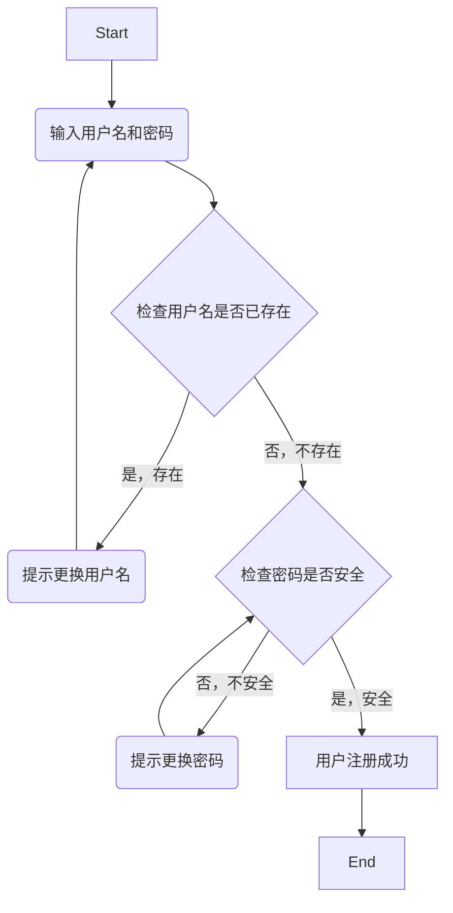

---

---

# 该如何测试呢

一个软件测试的流程为：

1. 分析需求
2. 设计测试点、覆盖需求（维度参考质量模型
3. 把测试点转化为可执行的用例文档
4. 执行测试
5. 缺陷管理（提交-验证-关闭）

## 例子

以用户登录为例

| 需求     | 测试点 | 条件                 |
| -------- | ------ | -------------------- |
| 用户登录 |        |                      |
|          | 账号   | 已注册的手机号或邮箱 |
|          | 密码   | 登录账号的密码       |
|          | 验证码 | 正确并且未过期       |

分析

| 需求     |        | 测试点                                                       |
| -------- | ------ | ------------------------------------------------------------ |
| 用户登录 |        |                                                              |
|          | 账号   | 已注册手机号、已注册邮箱、为空、未注册手机号（联通、电信、移动），邮箱（163、qq...），是否都覆盖 |
|          | 密码   | 登录账号的密码，为空，错误密码（不足指定位数，纯数字、纯英文、是否包含大小写特殊字符等等 |
|          | 验证码 | 正确、错误、过期、为空                                       |

此时有很多数据可以选择测试，该如何对数据进行筛选测试呢

### 等价类划分法

一种用少量数据取得较好测试效果的工具

含义：大量数据中，把数据分为同一类型来测试，等价划分

步骤：

1. 划分有效等价类：满足需求的数据集合
2. 划分无效等价类：不满足需求的数据集合
3. 每类中选取代表数据

#### 使用工具提取测试点

#### Xmind

[Xmind思维导图 | Xmind中文官方网站](https://xmind.cn/)

画思维导图，提取测试点

### 边界值分析法

以边界范围限制选取测试数据的方法

以边界范围为测试点

适用场景：有边界范围的时候使用

---

例如：密码登录时要求数据具备以下条件，8~16位且要求包含数字和字母

---

选取数据：

1. 上点：刚好是边界上的点，必选（不需考虑范围是否包含这个点）
2. 离点：距离上点最近的的点，选择俩个（**不包含上点时**选择范围内的点，**包含上点时**选择范围外的点）
3. 内点：边界范围内的任意点，必选（建议选范围中间值的点

---

步骤：

1. 边界值分析（负责测试长度范围）
2. 划分等价类（负责测试类型和规则）

---

在`8~16位且要求包含数字和字母`这个例子中，上点为8、16

离点包含上点时去范围外，7，17

内点选择12中间值

---

提取数据：

### 判定表法

以表格方式表达多条件逻辑判断的方法

前提：多条件约束中，条件为正确 or  错误

<table>
    <tr>
        <td rowspan="2">条件</td><td>条件1</td><td>是</td><td>是</td><td>否</td><td>否</td></tr><tr>
    <td>条件2</td><td>是</td><td>否</td><td>否</td><td>是</td>
    </tr>
        <tr>
        <td rowspan="2">动作</td><td>动作1</td><td>√</td><td>√</td><td></td><td></td></tr><tr>
    <td>动作2</td><td></td><td></td><td>X</td><td>X</td>
    </tr>
</table>

条件与动作均可以为多个动作或多个条件，不止两个动作或条件，仅为展示

名词解析：

- 条件桩：问题中的所有条件
- 动作桩：问题中的所有动作（结果）
- 条件项：条件可以为什么的值，所有可能情况下的真假值
- 动作项：条件项所导致的各个结果

条件越多，结果越多，2n叠加

---

示例：

判断是否可以使用优惠卷？

条件：

1. 要求须在规定时间内使用
2. 要求使用金额满足99  元

<table>
    <tr>
        <td rowspan="2">条件</td><td>指定时间内</td><td>是</td><td>是</td><td>否</td><td>否</td></tr><tr>
    <td>消费满99元</td><td>是</td><td>否</td><td>否</td><td>是</td>
    </tr>
        <tr>
        <td rowspan="2">动作</td><td>打折</td><td>√</td><td></td><td></td><td></td></tr><tr>
    <td>不打折</td><td></td><td>√</td><td>√</td><td>√</td>
    </tr>
</table>

测试点此时就可以分为四个

1. 指定时间内且消费满99元
2. 不在指定时间内且消费满99元
3. 指定时间内且消费未满99元
4. 不在指定时间内且消费未满99元

---

### 流程图法

用流程图的方式对软件的相应业务进行描述，找出业务中所有可能实现的流程

覆盖业务各个流程，每条路径均为一个测试用例

步骤：根据需求文档/系统设计文档找出项目的流程分析并画出流程图

---

示例：

需求/测试业务	

用户注册：

测试点:

1. 用户名已存在
2. 用户名不存在但密码不安全
3. 用户名不存在且密码安全

---

### 因果图法

!

### 状态转移法

### 场景法

​	
